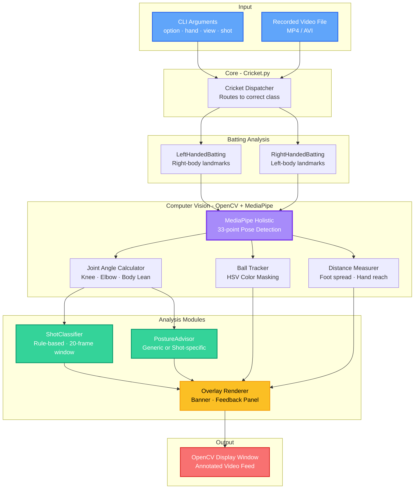
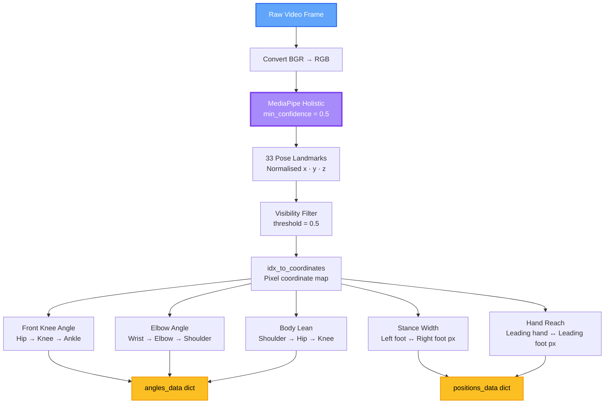
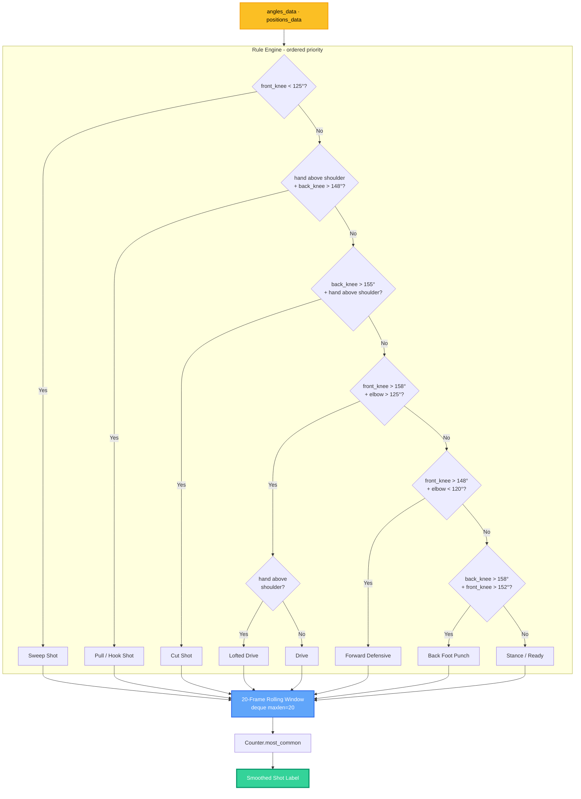
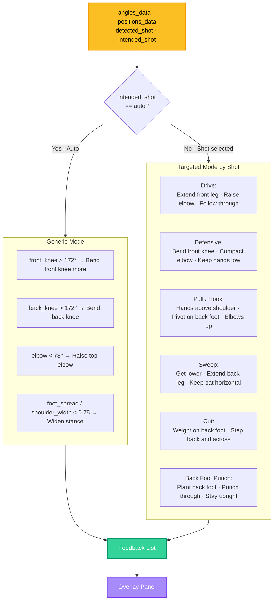
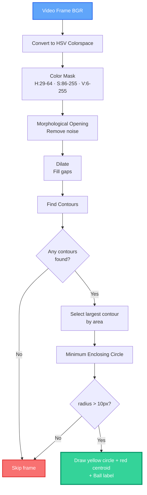

# CricketLytics — AI-Powered Cricket Batting Analyser

A computer vision tool that analyses cricket batting technique from recorded video. It uses **Google MediaPipe** for real-time pose detection and **OpenCV** for video processing to measure joint angles, classify shots, track the ball, and give targeted posture feedback — all overlaid directly on the video frame.

## Features

- **Pose Estimation**: Detects 33 body landmarks per frame using MediaPipe Holistic, drawing a full skeletal overlay on the player.
- **Joint Angle Measurement**: Computes and displays live angles for the front knee, back knee, top-hand elbow, and body lean (shoulder–hip–knee).
- **Shot Classification**: Automatically identifies the batting shot being played (Drive, Pull/Hook, Sweep, Cut, Forward Defensive, Back Foot Punch) using a rule-based classifier smoothed over a 20-frame window.
- **Targeted Posture Coaching**: Select the shot you are attempting via `--shot` flag and receive specific, biomechanically-grounded feedback (e.g. "Drive: extend front leg — push into the ball").
- **Ball Tracking**: Detects a green cricket ball in the frame using HSV color masking and contour detection, marking it with a labelled circle.
- **Stance Width Analysis**: Measures horizontal pixel distance between both feet and between the leading hand and leading foot.
- **Left & Right Handed Support**: Analyses mirrored landmark sets for both batting orientations.
- **Front & Side View Support**: Works with both front-facing and side-profile camera angles.

---

## System Architecture

High-level overview of the CricketLytics pipeline:



---

## Analysis Pipelines

### 1. Pose & Joint Angle Pipeline

How each video frame is processed to extract biomechanical measurements:



### 2. Shot Classification Pipeline

Rule-based classifier with temporal smoothing:



### 3. Posture Coaching Pipeline

Two modes — generic auto-analysis, or targeted shot-specific coaching:



### 4. Ball Tracking Pipeline

Detects a green cricket ball using HSV color segmentation:



---

## MediaPipe Landmark Reference

Key landmark indices used by the analyser:

| Index | Landmark | Used For |
|-------|----------|----------|
| `0` | Nose | Player label position |
| `11` | Left Shoulder | RHB elbow angle, body lean |
| `12` | Right Shoulder | LHB elbow angle, shoulder width |
| `13` | Left Elbow | RHB elbow angle |
| `14` | Right Elbow | LHB elbow angle |
| `15` | Left Wrist | RHB elbow angle, hand height |
| `16` | Right Wrist | LHB elbow angle, hand height |
| `23` | Left Hip | RHB knee + body lean |
| `24` | Right Hip | LHB knee + body lean |
| `25` | Left Knee | RHB front knee angle |
| `26` | Right Knee | LHB front knee angle |
| `27` | Left Ankle | RHB knee angle |
| `28` | Right Ankle | LHB knee angle |
| `29` | Left Foot Index | Stance width, hand reach |
| `30` | Right Foot Index | Stance width, hand reach |

> **RHB** = Right-Handed Batsman (uses left-body landmarks)  
> **LHB** = Left-Handed Batsman (uses right-body landmarks, mirrored)

---

## Shot Coaching Reference

| Shot | `--shot` value | Key Requirements |
|------|----------------|-----------------|
| Drive | `drive` | Front knee extends (>155°), elbow raised (>100°), follow-through above shoulder |
| Forward Defensive | `defensive` | Front knee bent (140–165°), elbow compact (<120°), hands low |
| Pull / Hook | `pull` | Both hands above shoulder, back foot pivot, elbows up |
| Sweep | `sweep` | Front knee deeply bent (<135°), back leg extended, bat horizontal |
| Cut Shot | `cut` | Weight on back foot (>148°), step back-and-across, hands high |
| Back Foot Punch | `back-punch` | Back foot planted firmly, elbow extension through contact |

---

## Tech Stack

| Component | Technology |
|-----------|-----------|
| Language | Python 3.10+ |
| Pose Estimation | MediaPipe ≥0.10.30 (`mp.tasks` Tasks API · `PoseLandmarker`) |
| Video Processing | OpenCV ≥4.8 (`cv2`) |
| Numerical Ops | NumPy ≥1.24 |
| Shot Smoothing | Python `collections.deque` + `Counter` |
| Ball Detection | HSV masking + contour analysis (OpenCV) |
| Angle Geometry | Custom dot-product math (`utils.py` + `headless_analyzer.py`) |
| Web API | FastAPI ≥0.110 + Uvicorn |
| Dashboard | Vanilla HTML / CSS / JavaScript + Chart.js |

---

## Project Structure

```
sports-el-cricket-analysis/
├── Cricket.py                      # CLI entry point — argument parsing & dispatch
├── requirements.txt                # All dependencies
├── pose_landmarker_lite.task       # MediaPipe pose model (download separately)
│
├── api/                            # FastAPI web backend
│   ├── __init__.py
│   └── server.py                   # POST /api/analyze — video upload → JSON stats
│
├── dashboard/                      # Futuristic web dashboard (served by FastAPI)
│   ├── index.html
│   ├── style.css
│   └── app.js
│
└── src/
    ├── utils.py                    # Geometry helpers: ang(), draw_ellipse(), convert_arc()
    ├── ThreadedCamera.py           # Legacy threaded camera reader (unused)
    ├── Analysis/
    │   ├── shot_classifier.py      # Rule-based shot detector with 20-frame smoothing
    │   ├── posture_advisor.py      # Generic + shot-specific posture coaching
    │   ├── headless_analyzer.py    # Headless pipeline → aggregated JSON stats (API)
    │   └── overlay.py              # Draws shot banner + feedback panel onto frames
    ├── Batting/
    │   ├── Batting.py              # Abstract base: bat(view) → front/side dispatch
    │   ├── LeftHandedBatting.py
    │   └── RightHandedBatting.py
    └── Bowling/
        ├── Bowling.py
        ├── LeftHandedBowling.py
        └── RightHandedBowling.py
```

---

## Setup & Installation

### Prerequisites

- **Python 3.10+**
- A recorded cricket video file (MP4 or AVI)
- For ball tracking: the ball in the video should be **green** (HSV colour mask assumes a green training ball)

### 1 — Install Dependencies

```bash
pip install -r requirements.txt
```

Or individually:

```bash
pip install "mediapipe>=0.10.30" "opencv-python>=4.8.0" "numpy>=1.24.0" \
            "fastapi>=0.110.0" "uvicorn[standard]>=0.29.0" "python-multipart>=0.0.9"
```

### 2 — Download the Pose Model

MediaPipe ≥0.10.30 uses the Tasks API and requires a `.task` model file.
Run this once from the repo root:

```bash
curl -L https://storage.googleapis.com/mediapipe-models/pose_landmarker/pose_landmarker_lite/float16/1/pose_landmarker_lite.task \
     -o pose_landmarker_lite.task
```

---

## Usage

### Option A — CLI (OpenCV display window)

```bash
# Basic auto-detection
python Cricket.py --option batting --hand right --view front --video path/to/video.mp4

# With intended shot coaching
python Cricket.py --option batting --hand right --view front \
  --video path/to/video.mp4 --shot drive

python Cricket.py --option batting --hand left --view side \
  --video path/to/video.mp4 --shot sweep
```

#### All CLI Arguments

| Argument | Required | Values | Description |
|----------|----------|--------|-------------|
| `--option` | ✅ | `batting` · `bowling` | Type of play to analyse |
| `--hand` | ✅ | `left` · `right` | Batting/bowling hand |
| `--view` | ✅ | `front` · `side` | Camera angle |
| `--video` | ✅ | File path | Path to the recorded MP4/AVI |
| `--shot` | ❌ | `auto` · `drive` · `defensive` · `pull` · `sweep` · `cut` · `back-punch` | Intended shot (default: `auto`) |

#### Keyboard Controls

| Key | Action |
|-----|--------|
| `ESC` | Exit the analyser |
| `P` | Pause / unpause playback |

---

### Option B — Web Dashboard (FastAPI + Browser UI)

A futuristic dark-mode dashboard that accepts a video upload and renders
aggregated stats — shot distribution chart, joint angle gauges, angle
timeline, and posture coaching tips.

**Start the server:**

```bash
# From the repo root
uvicorn api.server:app --port 8090 --reload
```

**Open your browser at:** `http://127.0.0.1:8090`

**Dashboard features:**
- 📤 Drag-and-drop video upload (MP4 / AVI)
- ⚙️ Configure hand, view, and intended shot
- ⏳ Live loading animation with step-by-step progress
- 🥧 Shot distribution donut chart (Chart.js)
- 📐 Average joint angle gauges with ideal-range colour coding
- 📈 Angle timeline chart across sampled frames
- 💡 Posture coaching tip cards
- 🏆 Technique score ring gauge

**API endpoint (JSON):**

```bash
curl -X POST http://127.0.0.1:8090/api/analyze \
  -F "video=@path/to/video.mp4" \
  -F "hand=right" \
  -F "view=front" \
  -F "intended_shot=drive"
```

Returns:

```json
{
  "total_frames": 450,
  "frames_analyzed": 390,
  "shot_distribution": { "Drive": 180, "Forward Defensive": 120, ... },
  "dominant_shot": "Drive",
  "average_angles": { "front_knee": 162.4, "front_elbow": 118.7 },
  "angle_timeline": [...],
  "coaching_tips": ["Drive: extend front leg — push into the ball", ...],
  "technique_score": 74
}
```

---

## On-Screen Display

```
┌──────────────────────────────────────────────────┐
│  Intended: Drive          Detected: Forward Def  │  ← coloured shot banner
├──────────────────────────────────────────────────┤
│                                                  │
│    [skeleton overlay + angle labels]             │
│    [yellow ball circle labelled "Ball"]          │
│    [yellow foot-to-hand measurement line]        │
│    [red foot-to-foot measurement line]           │
│                                                  │
├──────────────────────────────────────────────────┤
│  Drive Tips                                      │  ← feedback panel
│    Extend front leg — push into the ball         │
│    Follow through — hands above shoulder         │
└──────────────────────────────────────────────────┘
```

**Colour coding on skeleton:**
- 🔴 **Red lines** — joint angle guide lines
- 🟢 **Green text** — angle values in degrees
- 🟡 **Yellow lines** — distance measurements
- 🟡 **Yellow circle** — detected ball boundary
- 🔴 **Red dot** — ball centroid
